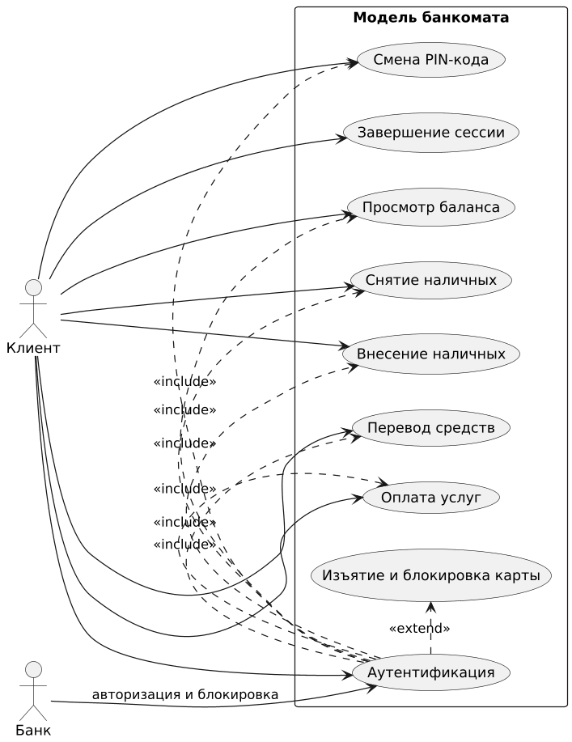
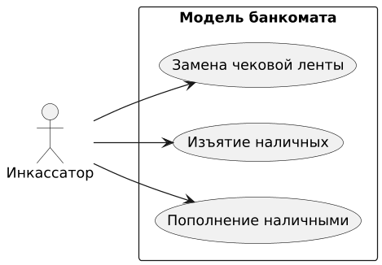

# Лабораторная работа №1  
**Предметная область**: модель банкомата (ATM)

**Среда разработки**: Visual Studio Code

**Язык написания кода**: Python 3.14.3

**Диаграммы**: PlantUML

## Текстовое описание предметной области

**Банкомат (ATM — Automated Teller Machine)** — это автоматизированное устройство самообслуживания, предназначенное для выполнения клиентами основных банковских операций без участия сотрудника банка.

### Основные функции банкомата

- Проверка баланса счёта  
- Выдача наличных денежных средств  
- Приём наличных для пополнения счёта
- Перевод денежных средств между счетами  
- Оплата услуг и платежи по реквизитам  
- Смена PIN-кода карты  

### Способы аутентификации

Работа банкомата осуществляется с использованием **банковских карт**:

- магнитная полоса  
- чип (EMV)  
- NFC / бесконтактная оплата (contactless)  

Аутентификация клиента выполняется путём ввода **PIN-кода**. При превышении допустимого количества неверных попыток ввода PIN карта блокируется в системе банка и изымается банкоматом.

### Взаимодействие с внешними системами

Банкомат обменивается данными с инфраструктурой банка:

- процессинговый центр  
- система авторизации  
- база данных счетов и лимитов  

### Жизненный цикл сессии пользователя

1. **Начало сессии** — успешная аутентификация (вставка карты + ввод корректного PIN-кода)
2. **Выполнение операций**
3. **Завершение сессии** одним из следующих способов:
   - извлечение карты (успешный выход)
   - явный выход пользователя
   - тайм-аут неактивности
   - **изъятие карты** банкоматом с одновременной блокировкой в системе банка (при многократном неверном вводе PIN или если карта уже была заблокирована ранее)

## Акторы системы

В модели банкомата выделены следующие акторы:

- **Клиент** (Client)  
  Основной пользователь системы. Человек, владеющий банковской картой и PIN-кодом. Инициирует сессию, выполняет финансовые операции (просмотр баланса, снятие/внесение наличных, переводы, оплата услуг, смена PIN).

- **Банк** (Bank)  
  Внешняя система (процессинговый центр + система авторизации + база счетов). Выполняет роль вторичного актора: проверяет аутентификацию, подтверждает наличие средств, списывает/зачисляет деньги, ведёт учёт транзакций. Банкомат взаимодействует с ним по сети.

- **Инкассатор** (Cash Replenisher)  
  Сотрудник банка или сервисной организации. Выполняет обслуживание банкомата: пополнение кассет наличными, изъятие наличных, замена чековой ленты. Имеет специальный ключ.

## Варианты использования (Use Cases)

Модель банкомата поддерживает следующие основные сценарии использования:

### Клиентские сценарии

- **Аутентификация** — Клиент вставляет карту и вводит PIN-код. Банк проверяет данные и разрешает/запрещает доступ.  
  В случае **многократного** неверного ввода PIN карта одновременно **блокируется** в системе банка и **изымается** банкоматом. Если карта уже была заблокирована ранее, банкомат изымает её немедленно после вставки (без попыток ввода PIN).
- **Просмотр баланса** — После успешной аутентификации клиент получает информацию о доступном остатке на счёте.
- **Снятие наличных** — Клиент выбирает сумму, система проверяет лимиты и наличие средств, выдаёт наличные.
- **Внесение наличных** — Клиент вносит купюры, банкомат их пересчитывает и зачисляет на счёт.
- **Перевод средств** — Клиент указывает реквизиты получателя и сумму, выполняется перевод.
- **Смена PIN-кода** — Клиент вводит старый и новый PIN, система обновляет данные через банк.
- **Завершение сессии** — Клиент выходит из системы, карта извлекается или сессия завершается по таймауту.

   

### Сценарии обслуживания (Инкассатор)

- **Пополнение наличными** — Инкассатор открывает кассету и загружает наличные.
- **Изъятие наличных** — Инкассатор извлекает накопленные купюры для инкассации.
- **Замена чековой ленты** — Инкассатор заменяет чековую ленту.

   

