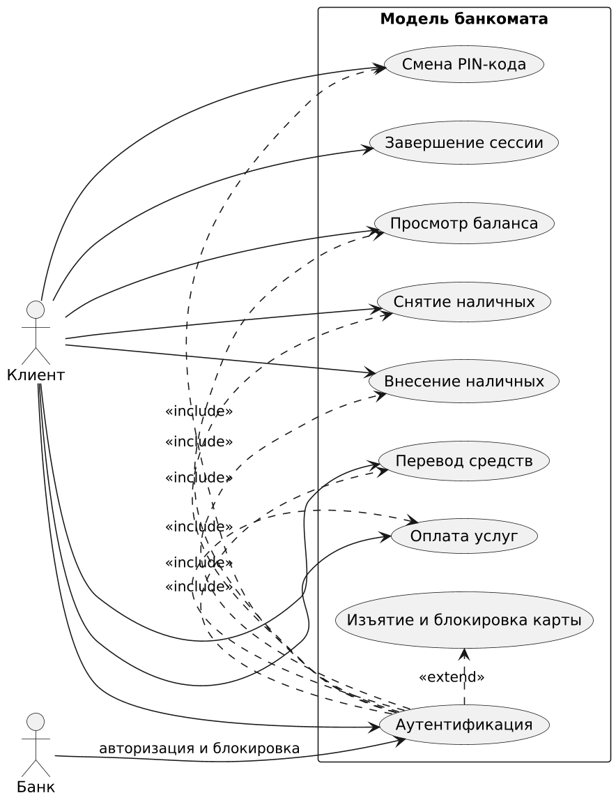
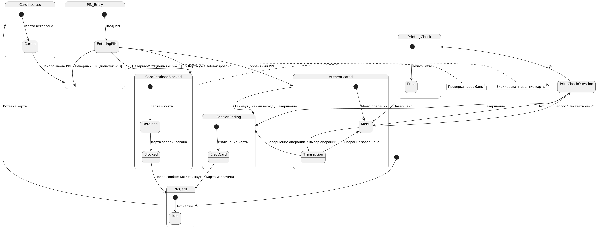
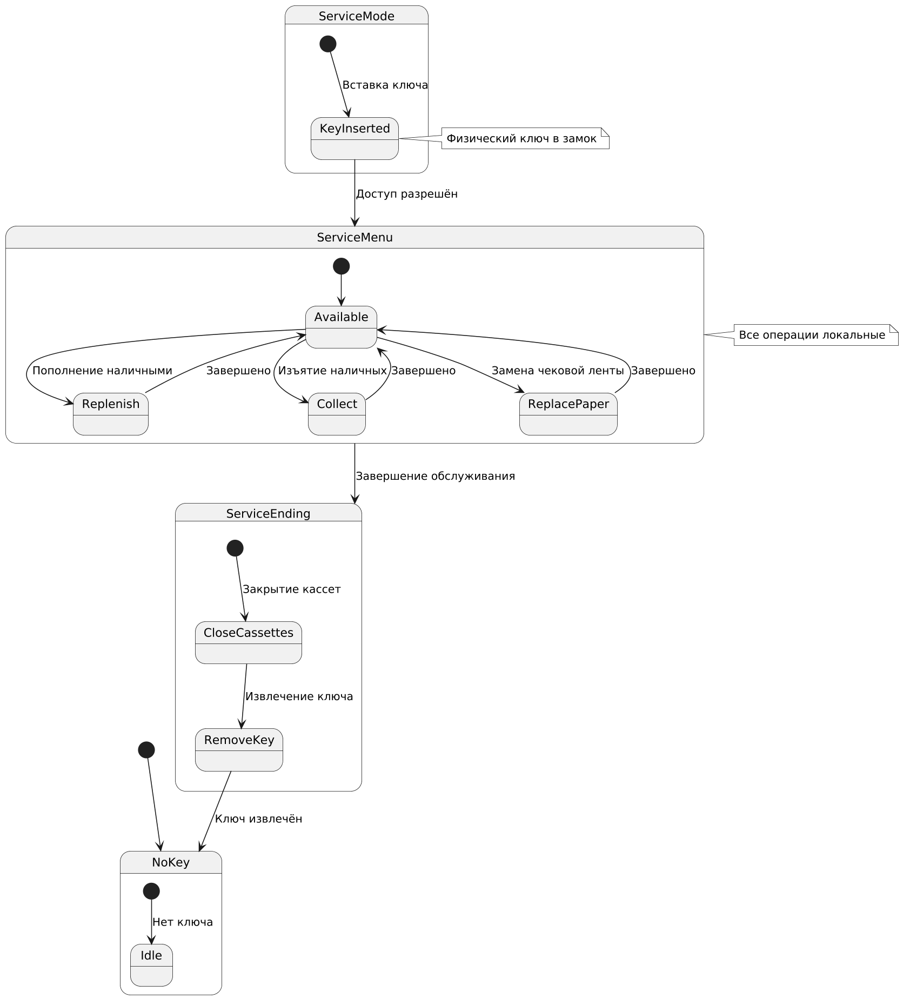
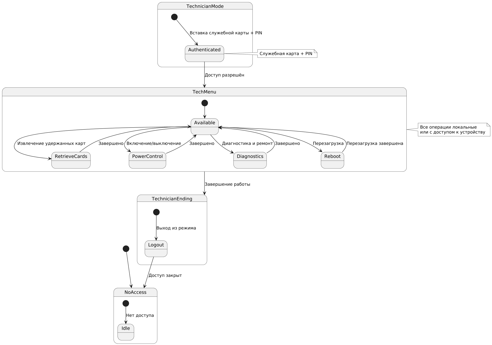

# Лабораторная работа №1  
**Предметная область**: модель банкомата (ATM)

**Среда разработки**: Visual Studio Code

**Язык написания кода**: Python 3.14.3

**Диаграммы**: PlantUML

## Текстовое описание предметной области

**Банкомат (ATM — Automated Teller Machine)** — это автоматизированное устройство самообслуживания, предназначенное для выполнения клиентами основных банковских операций без участия сотрудника банка.

### Основные функции банкомата

- Проверка баланса счёта  
- Выдача наличных денежных средств  
- Приём наличных для пополнения счёта
- Перевод денежных средств между счетами  
- Оплата услуг и платежи по реквизитам  
- Смена PIN-кода карты  

### Способы аутентификации

Работа банкомата осуществляется с использованием **банковских карт**:

- магнитная полоса  
- чип (EMV)  
- NFC / бесконтактная оплата (contactless)  

Аутентификация клиента выполняется путём ввода **PIN-кода**. При превышении допустимого количества неверных попыток ввода PIN карта блокируется в системе банка и изымается банкоматом.

### Взаимодействие с внешними системами

Банкомат обменивается данными с инфраструктурой банка:

- процессинговый центр  
- система авторизации  
- база данных счетов и лимитов  

### Жизненный цикл сессии пользователя

1. **Начало сессии** — успешная аутентификация (вставка карты + ввод корректного PIN-кода)
2. **Выполнение операций**
3. **Завершение сессии** одним из следующих способов:
   - извлечение карты (успешный выход)
   - явный выход пользователя
   - тайм-аут неактивности
   - **изъятие карты** банкоматом с одновременной блокировкой в системе банка (при многократном неверном вводе PIN или если карта уже была заблокирована ранее)

## Акторы системы

В модели банкомата выделены следующие акторы:

- **Клиент** (Client)  
  Основной пользователь системы. Человек, владеющий банковской картой и PIN-кодом. Инициирует сессию, выполняет финансовые операции (просмотр баланса, снятие/внесение наличных, переводы, оплата услуг, смена PIN).

- **Банк** (Bank)  
  Внешняя система (процессинговый центр + система авторизации + база счетов). Выполняет роль вторичного актора: проверяет аутентификацию, подтверждает наличие средств, списывает/зачисляет деньги, ведёт учёт транзакций. Банкомат взаимодействует с ним по сети.

- **Инкассатор** (Cash Replenisher)  
  Сотрудник банка или сервисной организации. Выполняет обслуживание банкомата: пополнение кассет наличными, изъятие наличных, замена чековой ленты. Имеет специальный ключ.

- **Технический специалист** (ATM Technician)  
  Специалист по обслуживанию оборудования. Выполняет техническое обслуживание банкомата: извлечение удержанных карт из ловушки, включение/выключение банкомата, диагностика, ремонт, перезагрузка, обновление ПО. Имеет доступ по служебной карте + PIN.

## Варианты использования (Use Cases)

Модель банкомата поддерживает следующие основные сценарии использования:

### Клиентские сценарии

- **Аутентификация** — Клиент вставляет карту и вводит PIN-код. Банк проверяет данные и разрешает/запрещает доступ.  
  В случае **многократного** неверного ввода PIN карта одновременно **блокируется** в системе банка и **изымается** банкоматом. Если карта уже была заблокирована ранее, банкомат изымает её немедленно после вставки (без попыток ввода PIN).
- **Просмотр баланса** — После успешной аутентификации клиент получает информацию о доступном остатке на счёте.
- **Снятие наличных** — Клиент выбирает сумму, система проверяет лимиты и наличие средств, выдаёт наличные.
- **Внесение наличных** — Клиент вносит купюры, банкомат их пересчитывает и зачисляет на счёт.
- **Перевод средств** — Клиент указывает реквизиты получателя и сумму, выполняется перевод.
- **Смена PIN-кода** — Клиент вводит старый и новый PIN, система обновляет данные через банк.
- **Завершение сессии** — Клиент выходит из системы, карта извлекается или сессия завершается по таймауту.

   

### Сценарии обслуживания (Инкассатор)

- **Пополнение наличными** — Инкассатор открывает кассету и загружает наличные.
- **Изъятие наличных** — Инкассатор извлекает накопленные купюры для инкассации.
- **Замена чековой ленты** — Инкассатор заменяет чековую ленту.

    

### Сценарии технического обслуживания (Технический специалист)

- **Извлечение удержанных карт** — Техник открывает внутренний отсек и извлекает карты, удержанные банкоматом (из-за ошибок аутентификации или по команде банка).
- **Включение/выключение банкомата** — Техник включает или выключает устройство для ремонта, обновления или планового обслуживания.
- **Диагностика и ремонт** — Техник проводит самотестирование, замену компонентов, обновление ПО.
- **Перезагрузка банкомата** — Техник выполняет принудительную перезагрузку для устранения сбоев.

    

## Диаграмма состояний

### Сессия клиента

    

### Сессия инкассатора

    

### Сессия технического специалиста

    

## Проектирование классов

Проектирование классов выполнено с учётом принципов SOLID. Система разбита на модули, каждый из которых отвечает за свою область ответственности.

### Структура модулей и классов

- **UserInterfaceModule** — отвечает за взаимодействие с пользователем через CLI  
  - `Display` — вывод информации на консоль  
  - `Keypad` — обработка ввода пользователя  
  - `SessionTimer` — отслеживание таймаута неактивности  
  - `SoundPlayer` — симуляция звуковых сигналов (print)

- **CardReaderModule** — работа с банковскими картами  
  - `CardReader` — симуляция чтения карты  
  - `Card` — данные карты (номер, срок действия и т.д.)  
  - `CardRetainer` — логика удержания карты  
  - `CardStatusChecker` — проверка статуса карты (заблокирована или нет)

- **AuthenticationModule** — аутентификация пользователей  
  - `AuthenticationService` — основной сервис аутентификации  
  - `PinValidator` — проверка PIN-кода  
  - `CardBlockStatusChecker` — запрос статуса блокировки карты

- **TransactionModule** — выполнение клиентских операций  
  - `Transaction` — абстрактный базовый класс транзакции  
  - `TransactionFactory` — фабрика создания транзакций  
  - `WithdrawalTransaction` — снятие наличных  
  - `DepositTransaction` — внесение наличных  
  - `BalanceInquiryTransaction` — просмотр баланса  
  - `PinChangeTransaction` — смена PIN  
  - `TransferTransaction` — перевод средств  
  - `PaymentTransaction` — оплата услуг

- **CashHandlingModule** — работа с наличными деньгами  
  - `CashDispenser` — выдача наличных  
  - `CashAcceptor` — приём наличных  
  - `CashInventory` — учёт наличных в кассетах

- **ReceiptPrinterModule** — печать чеков и отчётов  
  - `ReceiptPrinter` — симуляция печати  
  - `ReceiptTemplate` — шаблон чека  
  - `PaperSensor` — датчик наличия бумаги

- **CashManagementModule** — инкассация и управление наличными  
  - `CashReplenisher` — пополнение кассет  
  - `CashCollector` — изъятие наличных  
  - `CassetteManager` — управление кассетами  
  - `CashReplenisherAuthenticator` — авторизация инкассатора

- **TechnicianServiceModule** — техническое обслуживание  
  - `RetainedCardCollector` — извлечение удержанных карт  
  - `PowerController` — управление питанием  
  - `RebootController` — перезагрузка банкомата  
  - `TechnicianAuthenticator` — авторизация техника

- **BankCommunicationModule** — взаимодействие с банком  
  - `BankGateway` — шлюз к банку (симуляция)  
  - `MockBankRepository` — имитация базы банка (карты, счета, статусы)  
  - `AccountData` — данные счёта (баланс, блокировка, PIN)

- **PowerAndHardwareModule** — управление питанием и аппаратной частью  
  - `PowerManager` — симуляция включения/выключения

- **SessionManager** — управление сессиями и состояниями  
  - `ATMStateMachine` — конечный автомат состояний  
  - `Session` — текущая сессия  
  - `SessionType` — тип сессии (enum: CLIENT, CASH_REPLENISHER, TECHNICIAN)  
  - `State` — базовый класс состояния  
  - `StateSaver` — сохранение состояния  
  - `Logger` — логирование событий

- **Сквозные классы**  
  - `ATM` — главный оркестратор системы (композирует модули)  
  - `Configuration` — глобальные настройки  
  - `PersistenceManager` — сохранение/загрузка состояния системы

### Диаграмма модулей и классов

    

